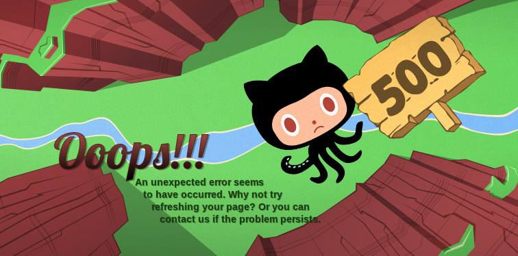
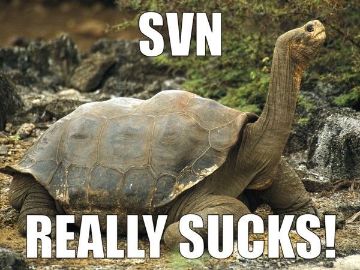

<!SLIDE center transition=fade>

# Why another Github Discussion? #

<!SLIDE center transition=cover>

## Git ##

<!SLIDE center transition=uncover>

## GitHub ##

<!SLIDE center transition=cover>

