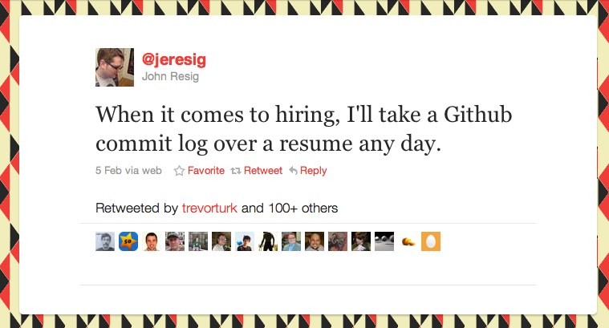
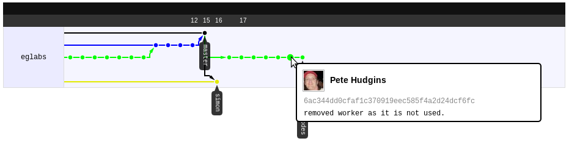
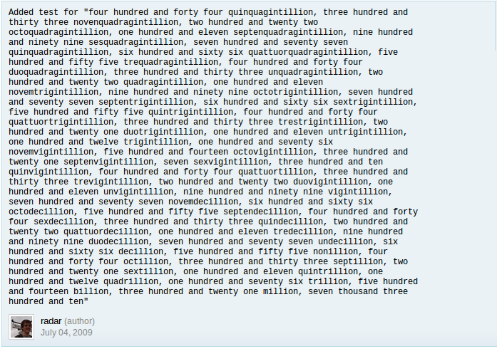
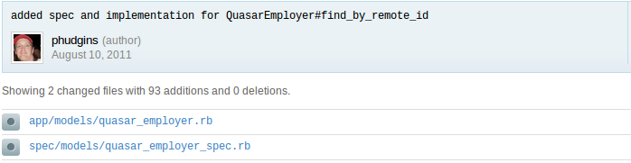

<!SLIDE center transition=fade>

# Commits #

<!SLIDE center transition=cover>

## Make frequent, small commits ##

<!SLIDE center transition=uncover>

## Use clear, concise messages for each commit ##

<!SLIDE center transition=cover>

## Try not to be **too** verbose ##

<!SLIDE center transition=uncover>

## Only commit files that are directly related ##

