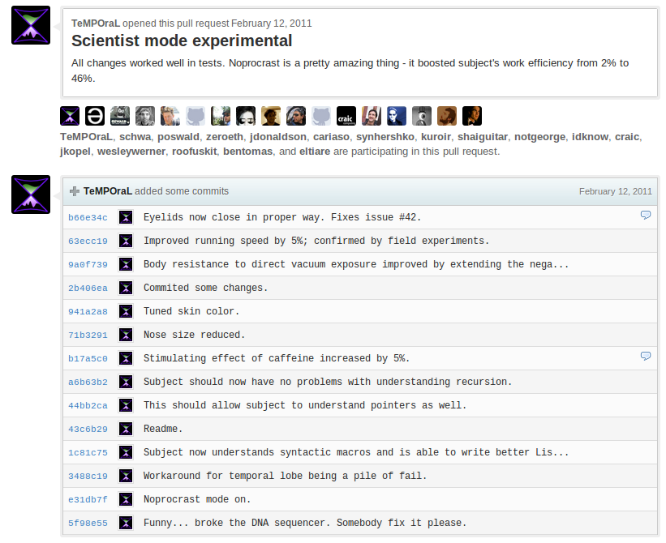
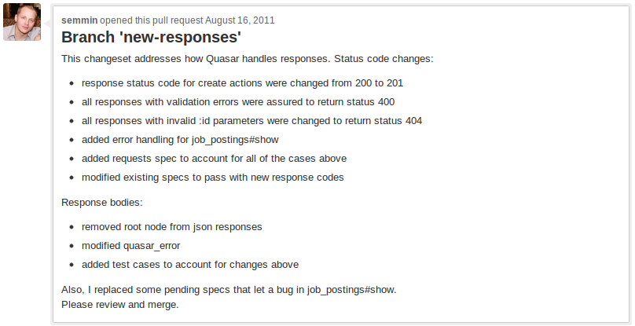

<!SLIDE center transition=fade>

# Pull Requests #

<!SLIDE transition=cover>

## To get your code merged, send a pull request! ##

> Master of Pull Requests look at my code

> I did and you need to refactor your code

> Don't forget to run rake db:load

> Especially when in development mode!

> fix(); ME!!!

> -- <cite>[@sjtipton](http://twitter.com/#!/sjtipton)</cite>

<!SLIDE center transition=uncover>

<!SLIDE smbullets incremental transition=cover>

## When Sending a Pull Request: ##

* Ensure that your branch has the latest changes from master
* Ensure that your changes work with the master branch codebase (tests, specs are green)
* Do not include items that are not ready to be merged into master in your pull request, e.g. work that is actively under development.

<!SLIDE smbullets incremental transition=uncover>

## When Sending a Pull Request: ##

* Do not include others code that does not directly support your change **AND** has not been pulled into master.
* The diff should **only** solve a specific issue or similar group of issues. Explain what issues are solved by your changes.

<!SLIDE center transition=cover>

## Write a detailed description of the changeset! ##

