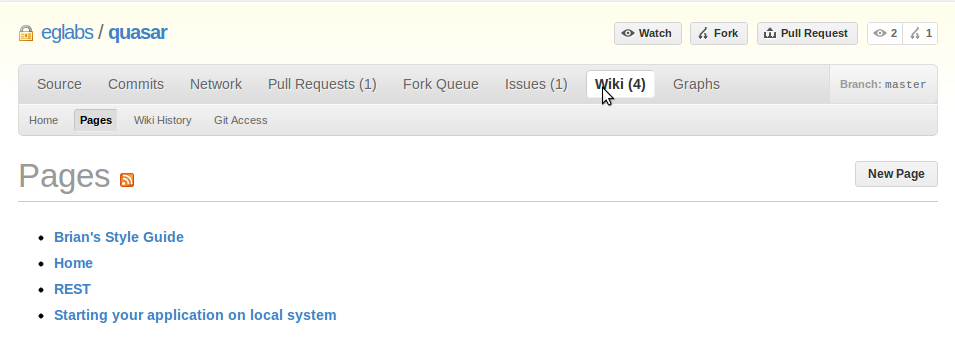
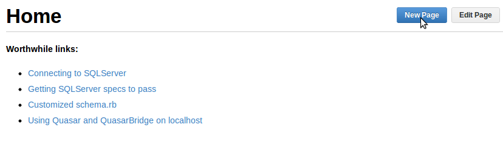
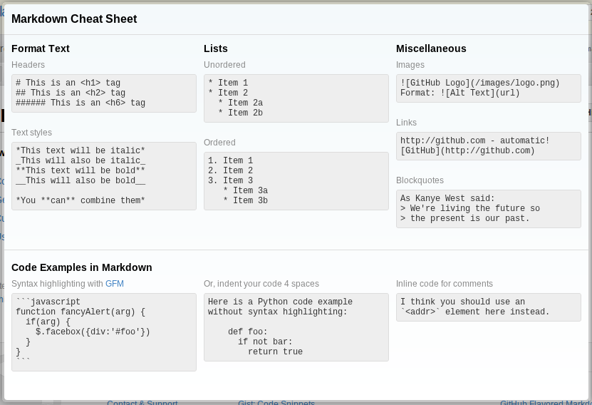

<!SLIDE center transition=fade>

# Wikis #

<!SLIDE center transition=cover>

## To find out more about a project, check the wiki ##

<!SLIDE center transition=uncover>

## Contribute to the wiki on projects you are part of ##

<!SLIDE center transition=cover>

### Markdown Cheatsheet ###

